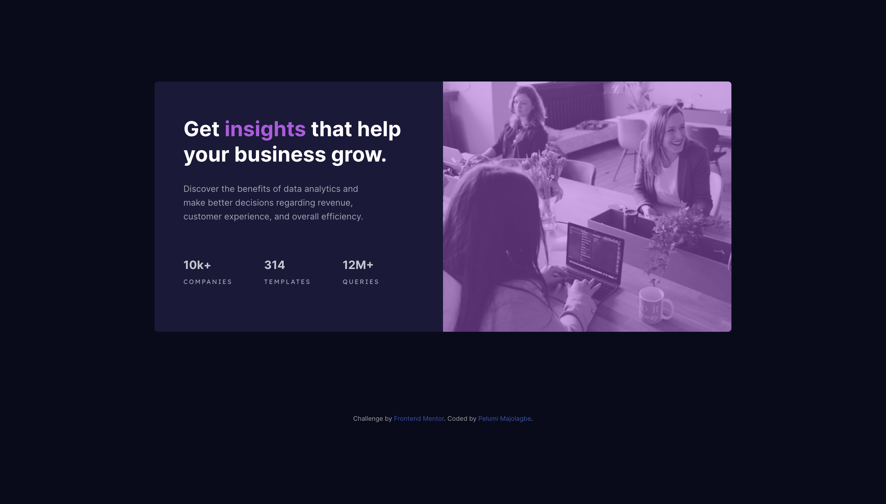

# Frontend Mentor - Stats preview card component solution

This is a solution to the [Stats preview card component challenge on Frontend Mentor](https://www.frontendmentor.io/challenges/stats-preview-card-component-8JqbgoU62). Frontend Mentor challenges help you improve your coding skills by building realistic projects.

## Table of contents

- [Overview](#overview)
  - [The challenge](#the-challenge)
  - [Screenshot](#screenshot)
  - [Links](#links)
  - [Built with](#built-with)
  - [What I learned](#what-i-learned)
- [Author](#author)

**Note: Delete this note and update the table of contents based on what sections you keep.**

## Overview

Stats preview card component challenge

### The challenge

Users should be able to:

- View the optimal layout depending on their device's screen size

### Screenshot



### Links

- Solution URL: [GitHub](https://github.com/Mapelsun/stats-card-component)
- Live Site URL: [GitHub Pages](https://mapelsun.github.io/stats-card-component/)

### Built with

- Semantic HTML5 markup
- Imported Google fonts
- CSS custom properties
- CSS Flexbox and Grid
- Mobile-first workflow
- BEM and SCSS

### What I learned

Use of srcset to provide the best optimal image for users based on width.

See below:

```html
<div class="img-box">
  
</div>
```

## Author

- Website - [Pelumi Majolagbe](https://pelumi.dev/)
- Frontend Mentor - [@Mapelsun](https://www.frontendmentor.io/profile/Mapelsun)
- Twitter - [@Mapelsun](https://www.twitter.com/Mapelsun)
